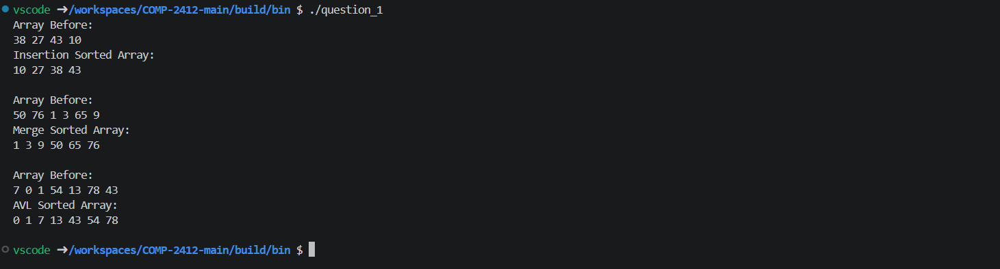
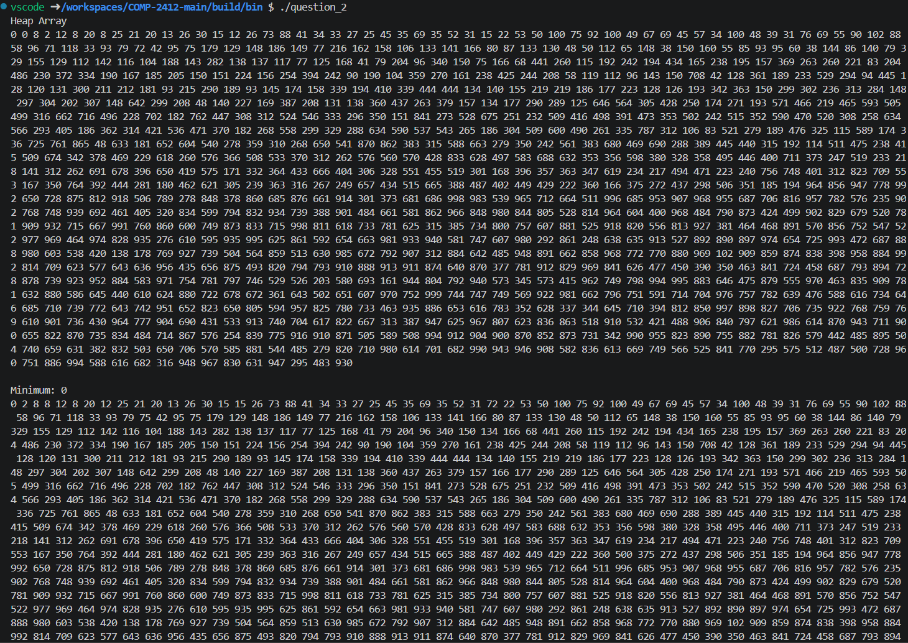
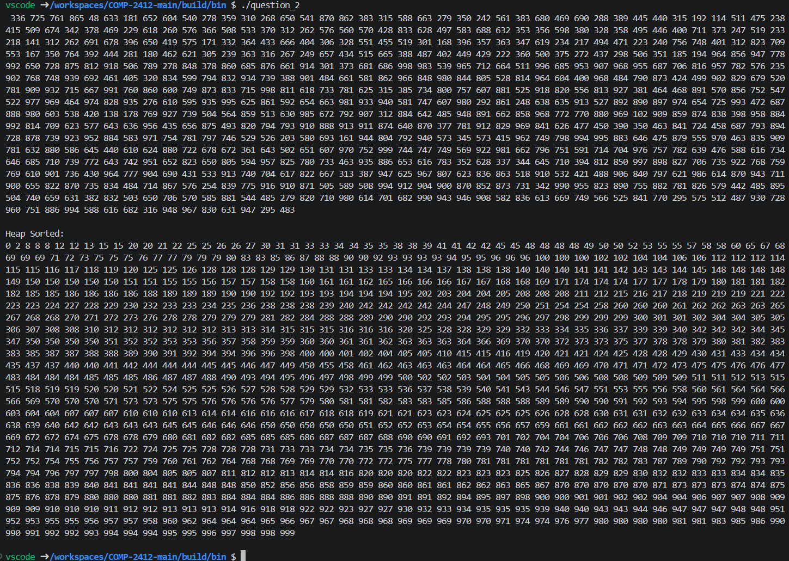
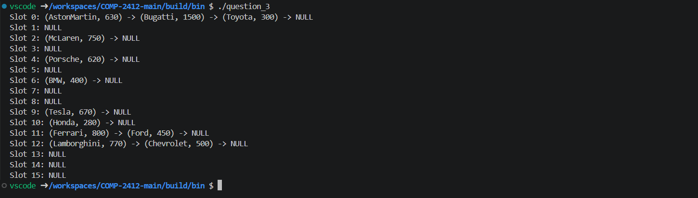
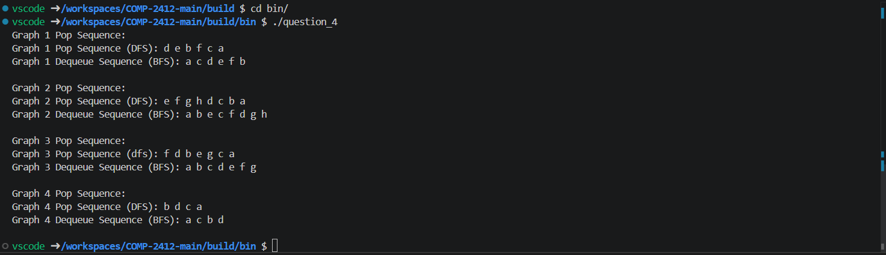

<h1> COMP2412 - Assignment 3 </h1>

<h3> Question 1 </h3>

<h5> a) </h5>

 The difference between Big O and Big Θ notation is that Big O typically describes the worst case scenario of an algorithm's running time. It is the highest limit of the growth of the function describing the algorithm's running time. Big Θ is the algorithms precise running time and describes the growth of the function describing the algorithm's running time in that specific rate.

<h5> b) </h5>
<h6> i) </h6>

 f(n) = n^2 + 3n + 2 and g(n) = 4n^2 + 2 

 Drop Constants: f(n) = Θ(n^2) | g(n) = Θ(n^2) 

 Based on the time complexity of both functions, both f(n) and g(n) grow at the same rate. F(n) = Θg(n) 

<h6> ii) </h6>

 f(n) = 2^n and g(n) = n^5 

 f(n) = Θ(2^n) | g(n) = Θ(n^5)

 Based on the time complexity of both functions, f(n) grows at a slower rate than g(n). g(n) = O(f(n)) 

<h6> iii) </h6>

 f(n) = log(n) and g(n) = n 

 f(n) = Θ(log n) | g(n) = Θ(n) 

 
Based on the time complexity of both algorithms, g(n) grows at a slower rate than f(n). Constant time functions grow at a slower rate than logarithmic functions. f(n) = O(g(n)) 

<h6> iv) </h6>

 f(n) = n! and g(n) = 2^n 

 f(n) = Θ(n!) | g(n) = Θ(2^n) 

 Based on the time complexity analysis, g(n) grows more slowly than f(n). f(n) = O(g(n)) 

<h5> c) </h5>

 For Code Refer to .cpp File(s) 

<h6> i), ii) & iii)</h6>

<h3> Question 2 </h3>

<h5> a) </h5>

 For Code Refer to .cpp File(s)

<h5> b) </h5>

 For Code Refer to .cpp File(s)

<h5> c) </h5>

 Building Sorted Array: 

<ul> 
    <li> Input => Array of Values </li>
    <li> Size of Input => n </li>
    <li> Basic Operation => FixMinNode(); </li>
    <li> # of BO => n</li>
    <li> Complexity => θ(n) </li>
</ul>

 ExtractMin(): 

<ul> 
    <li> Input => Array of Values </li>
    <li> Size of Input => n </li>
    <li> Basic Operation => FixMinNode(); </li>
    <li> # of BO => θ(logn) </li>
    <li> Complexity => θ(logn) </li>
</ul>

 Heap Sort => θ( θ(n) * θ(logn) ) => θ(nlogn) 

<h3> Question 3 </h3>

 For Code Refer to .cpp File(s) 
 

<h3> Question 4 </h3>
<h5> a) </h5>

 For Code Refer to .cpp File(s) 
 

<h5> b) </h5>

 For Code Refer to .cpp File(s) 
 

